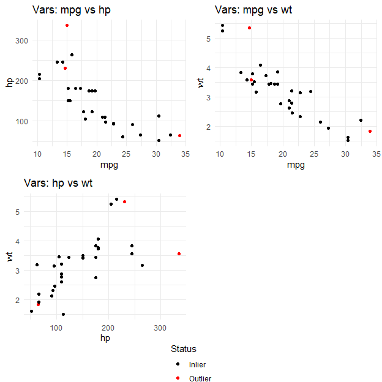

# Multivariate Outlier Detection Package

## Introduction

An outlier can be defined as an observation or subset of observations
that appears to be inconsistent with the rest of the data and do not fit
into the overall trend. They may appear due to various reasons,
including mistakes in data collection or recording, natural variation,
or the representation of uncommon but valid data points. In statistics
and data science, identifying outliers is an essential preprocessing
step to ensure the robustness and accuracy of analyses. While univariate
outliers can often be detected easily, multivariate outliers which
result from complex interactions among multiple variables are more
difficult to identify. If those hidden anomalies are not properly
addressed, they can bias model conclusions and significantly degrade
model performance. Therefore, multivariate outlier detection plays a
vital role in the statistical analysis of multidimensional data.

The package is designed to include several useful components. It offers
three distinct techniques for identifying outliers in multivariate data:
Mahalanobis Distance, Minimum Covariance Determinant, and Principal
Component Analysis-based distance.The program makes use of the Rcpp
package’s C++ integration, which speeds up computations and makes
handling bigger datasets possible.Furthermore, the package incorporates
pairwise plots that highlight possible outliers to improve the
interpretability of results for those without a background in
statistics.

## Installation

The package can be installed directly from GitHub using the `devtools`
package.

``` r
# Install devtools if not already installed
install.packages("devtools")

# Install the MOutliers package from GitHub (with tests)
devtools::install_github("SenuYasara/Multivariate_Outlier_Detection_R_Package",
  INSTALL_opts = "--install-tests"
)
```

Once installed, the package can be loaded in R as follows:

``` r
library(MOutliers)
```

To run the included unit tests after installation:

``` r
library(testthat)
test_package("MOutliers")
```

These tests confirm that the functions `detect_multivariate_outliers()`
and `plot_outliers()` behave as expected, producing correct outputs and
handling invalid inputs appropriately.

## Example Usage

### Function: detect_multivariate_outliers()

#### Example 1: Simulated Data

This example demonstrates detecting multivariate outliers using
simulated data.

``` r
set.seed(123)
df <- data.frame(
  x = c(rnorm(50), 5),
  y = c(rnorm(50), 5)
)
head(df)
#>             x           y
#> 1 -0.56047565  0.25331851
#> 2 -0.23017749 -0.02854676
#> 3  1.55870831 -0.04287046
#> 4  0.07050839  1.36860228
#> 5  0.12928774 -0.22577099
#> 6  1.71506499  1.51647060
```

``` r
# Mahalanobis Distance

result_mahal <- detect_multivariate_outliers(df, method = "mahalanobis", alpha = 0.975)
head(result_mahal)
#>             x           y  Distance Outlier
#> 1 -0.56047565  0.25331851 0.4151305   FALSE
#> 2 -0.23017749 -0.02854676 0.1188414   FALSE
#> 3  1.55870831 -0.04287046 2.0584218   FALSE
#> 4  0.07050839  1.36860228 1.1817300   FALSE
#> 5  0.12928774 -0.22577099 0.1948453   FALSE
#> 6  1.71506499  1.51647060 2.3906742   FALSE
```

``` r
# Minimum Covariance Determinant (MCD)

result_mcd <- detect_multivariate_outliers(df, method = "mcd", alpha = 0.975)
head(result_mcd)
#>             x           y  Distance Outlier
#> 1 -0.56047565  0.25331851 0.4591213   FALSE
#> 2 -0.23017749 -0.02854676 0.1299266   FALSE
#> 3  1.55870831 -0.04287046 2.5319996   FALSE
#> 4  0.07050839  1.36860228 2.7497316   FALSE
#> 5  0.12928774 -0.22577099 0.2077008   FALSE
#> 6  1.71506499  1.51647060 6.5143416   FALSE
```

``` r
# Principal Component Analysis (PCA)

result_pca <- detect_multivariate_outliers(df, method = "pca", alpha = 0.975)
head(result_pca)
#>             x           y  Distance Outlier
#> 1 -0.56047565  0.25331851 0.3621629   FALSE
#> 2 -0.23017749 -0.02854676 0.1566441   FALSE
#> 3  1.55870831 -0.04287046 1.6023335   FALSE
#> 4  0.07050839  1.36860228 1.0066602   FALSE
#> 5  0.12928774 -0.22577099 0.1726165   FALSE
#> 6  1.71506499  1.51647060 3.1785118   FALSE
```

#### Example 2: Existing Dataset (mtcars)

This example demonstrates detecting multivariate outliers using a real
dataset (mtcars) with three variables: mpg, hp, and wt.

``` r
df_mtcars <- mtcars[, c("mpg", "hp", "wt" )]
head(df_mtcars)
#>                    mpg  hp    wt
#> Mazda RX4         21.0 110 2.620
#> Mazda RX4 Wag     21.0 110 2.875
#> Datsun 710        22.8  93 2.320
#> Hornet 4 Drive    21.4 110 3.215
#> Hornet Sportabout 18.7 175 3.440
#> Valiant           18.1 105 3.460
```

``` r
# Mahalanobis Distance

result_mahal <- detect_multivariate_outliers(df_mtcars, method = "mahalanobis"
                                             ,alpha = 0.975)
head(result_mahal)
#>                    mpg  hp    wt  Distance Outlier
#> Mazda RX4         21.0 110 2.620 1.4554908   FALSE
#> Mazda RX4 Wag     21.0 110 2.875 0.6848547   FALSE
#> Datsun 710        22.8  93 2.320 1.8717032   FALSE
#> Hornet 4 Drive    21.4 110 3.215 0.5058688   FALSE
#> Hornet Sportabout 18.7 175 3.440 0.1960802   FALSE
#> Valiant           18.1 105 3.460 2.0085341   FALSE
```

``` r
# Minimum Covariance Determinant (MCD)

result_mcd <- detect_multivariate_outliers(df_mtcars, method = "mcd", alpha = 0.975)
head(result_mcd)
#>                    mpg  hp    wt  Distance Outlier
#> Mazda RX4         21.0 110 2.620 1.4032515   FALSE
#> Mazda RX4 Wag     21.0 110 2.875 0.4356093   FALSE
#> Datsun 710        22.8  93 2.320 1.7928535   FALSE
#> Hornet 4 Drive    21.4 110 3.215 0.7528113   FALSE
#> Hornet Sportabout 18.7 175 3.440 1.8629727   FALSE
#> Valiant           18.1 105 3.460 3.1254814   FALSE
```

``` r
# Principal Component Analysis (PCA)

result_pca <- detect_multivariate_outliers(df_mtcars, method = "pca", alpha = 0.975)
head(result_pca)
#>                    mpg  hp    wt  Distance Outlier
#> Mazda RX4         21.0 110 2.620 0.5460497   FALSE
#> Mazda RX4 Wag     21.0 110 2.875 0.3829775   FALSE
#> Datsun 710        22.8  93 2.320 1.5163542   FALSE
#> Hornet 4 Drive    21.4 110 3.215 0.3326773   FALSE
#> Hornet Sportabout 18.7 175 3.440 0.2723783   FALSE
#> Valiant           18.1 105 3.460 0.4647775   FALSE
```

### Function: plot_outliers()

#### Example 1: Simulated Data

This example demonstrates visualizing 2D scatterplots for each pair of
variable in the dataset using simulated data.

``` r
# Mahalanobis Distance
plot_outliers(df, method = "mahalanobis", alpha = 0.975)
```


``` r
# Minimum Covariance Determinant (MCD)
plot_outliers(df, method = "mcd", alpha = 0.975)
```


#### Example 2: Existing Dataset (mtcars)

This example demonstrates visualizing 2D scatterplots for each pair of
variable in the dataset using a real dataset (mtcars) with three
variables: mpg, hp, and wt.

``` r
# Mahalanobis Distance
plot_outliers(df_mtcars, method = "mahalanobis", alpha = 0.975)
```



``` r
# Minimum Covariance Determinant (MCD)
plot_outliers(df_mtcars, method = "mcd", alpha = 0.975)
```


