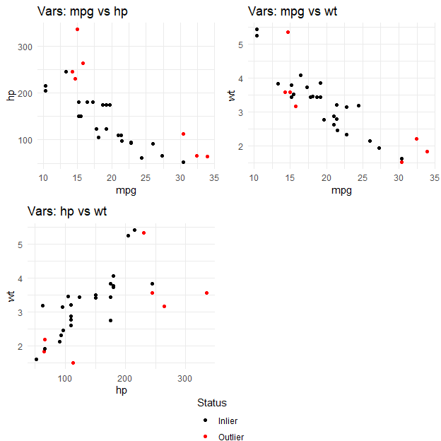

# Multivariate Outlier Detection Package

## Introduction

The purpose of this report is to present a draft and the test plan of an
upcoming R package called “MOutliers.” This package aims to identify and
visualize outliers in multivariate data.

Outliers are data points that deviate from the rest of the data and do
not fit into the overall trend. They may appear due to various reasons,
including mistakes in data collection/recording, natural variation, or
the representation of uncommon but valid data points. When it comes to
statistics, detecting outliers is very important because their presence
can influence statistical summaries, distort parameter estimates, and
even reduce the reliability of predictive models.

For these reasons, outlier detection is a key step in modern statistics
and data science.

The package is designed to include several useful components. It offers
three distinct techniques for identifying outliers in multivariate data:
Mahalanobis Distance, Minimum Covariance Determinant, and Principal
Component Analysis-based distance.The program makes use of the Rcpp
package’s C++ integration, which speeds up computations and makes
handling bigger datasets possible.Furthermore, the package incorporates
pairwise plots that highlight possible outliers to improve the
interpretability of results for those without a background in
statistics. This report describes how to install the package, how to
utilize its functions, and how to use the testthat framework to ensure
that these functions are working properly.

## Function Documentation

### Function: detect_multivariate_outliers()

**Parameters**

**1. data (Required)**

A numeric dataframe that contains the variables of interest. Each row
corresponds to one observation and each column to one variable.

**2. method (Optional)**

A character value specifying the detection method. Options include:

- “mahalanobis”: classical Mahalanobis distance

- “mcd”: Minimum Covariance Determinant (robust method)

- “pca”: principal component based Euclidean distances.

Default is “mahalanobis”.

**3. alpha (Optional)**

A numeric value representing the cutoff level for detecting outliers,
based on the quantiles of the chi-squared distribution. Default is
0.975.

**Returns**

The function returns a data frame that combines the original input
dataset with the following additional columns:

- Distance: the computed distance value for each observation (depends on
  the chosen method).

- Outlier: TRUE if the observation is flagged as an outlier. Otherwise,
  FALSE.

### Function: plot_outliers()

**Parameters**

**1. data (Required)**

A numeric dataframe with atleast two continous variables.

**2. method (Optional)**

A character value specifying the outlier detection approach. Options
include:

- “mahalanobis”: classical Mahalanobis distance

- “mcd”: Minimum Covariance Determinant (robust method)

Default is “mahalanobis”.

**3. alpha (Optional)**

A numeric value specifying the cutoff quantile for identifying outliers
from the chi-squared distribution. Default is 0.975.

**Returns**

A set of 2D scatterplots for each pair of variables in the dataset. Only
works for either Mahalanobis or MCD distances. Outlier are highlighted
in red, while inliers are shown in black. The function also arranges all
pairwise scatterplots into one frame.

## Installing

The package can be installed directly from GitHub using the `devtools`
package.

``` r
# Install devtools if not already installed
install.packages("devtools")

# Install the MOutliers package from GitHub (with tests)
devtools::install_github("SenuYasara/Multivariate_Outlier_Detection_R_Package",
  INSTALL_opts = "--install-tests"
)
```

Once installed, the package can be loaded in R as follows:

``` r
library(MOutliers)
```

To run the included unit tests after installation:

``` r
library(testthat)
test_package("MOutliers")
```

These tests confirm that the functions `detect_multivariate_outliers()`
and `plot_outliers()` behave as expected, producing correct outputs and
handling invalid inputs appropriately.

## Example Usage

### Function: detect_multivariate_outliers()

#### Example 1: Simulated Data

This example demonstrates detecting multivariate outliers using
simulated data.

``` r
set.seed(123)
df <- data.frame(
  x = c(rnorm(50), 5),
  y = c(rnorm(50), 5)
)
head(df)
#>             x           y
#> 1 -0.56047565  0.25331851
#> 2 -0.23017749 -0.02854676
#> 3  1.55870831 -0.04287046
#> 4  0.07050839  1.36860228
#> 5  0.12928774 -0.22577099
#> 6  1.71506499  1.51647060
```

``` r
# Mahalanobis Distance

result_mahal <- detect_multivariate_outliers(df, method = "mahalanobis"
                                             , alpha = 0.975)
head(result_mahal)
#>             x           y  Distance Outlier
#> 1 -0.56047565  0.25331851 0.4151305   FALSE
#> 2 -0.23017749 -0.02854676 0.1188414   FALSE
#> 3  1.55870831 -0.04287046 2.0584218   FALSE
#> 4  0.07050839  1.36860228 1.1817300   FALSE
#> 5  0.12928774 -0.22577099 0.1948453   FALSE
#> 6  1.71506499  1.51647060 2.3906742   FALSE
```

``` r
# Minimum Covariance Determinant (MCD)

result_mcd <- detect_multivariate_outliers(df, method = "mcd"
                                           , alpha = 0.975)
head(result_mcd)
#>             x           y  Distance Outlier
#> 1 -0.56047565  0.25331851 0.4591213   FALSE
#> 2 -0.23017749 -0.02854676 0.1299266   FALSE
#> 3  1.55870831 -0.04287046 2.5319996   FALSE
#> 4  0.07050839  1.36860228 2.7497316   FALSE
#> 5  0.12928774 -0.22577099 0.2077008   FALSE
#> 6  1.71506499  1.51647060 6.5143416   FALSE
```

``` r
# Principal Component Analysis (PCA)

result_pca <- detect_multivariate_outliers(df, method = "pca"
                                           , alpha = 0.975)
head(result_pca)
#>             x           y  Distance Outlier
#> 1 -0.56047565  0.25331851 0.3621629   FALSE
#> 2 -0.23017749 -0.02854676 0.1566441   FALSE
#> 3  1.55870831 -0.04287046 1.6023335   FALSE
#> 4  0.07050839  1.36860228 1.0066602   FALSE
#> 5  0.12928774 -0.22577099 0.1726165   FALSE
#> 6  1.71506499  1.51647060 3.1785118   FALSE
```

#### Example 2: Existing Dataset (mtcars)

This example demonstrates detecting multivariate outliers using a real
dataset (mtcars) with three variables: mpg, hp, and wt.

``` r
df_mtcars <- mtcars[, c("mpg", "hp", "wt" )]
head(df_mtcars)
#>                    mpg  hp    wt
#> Mazda RX4         21.0 110 2.620
#> Mazda RX4 Wag     21.0 110 2.875
#> Datsun 710        22.8  93 2.320
#> Hornet 4 Drive    21.4 110 3.215
#> Hornet Sportabout 18.7 175 3.440
#> Valiant           18.1 105 3.460
```

``` r
# Mahalanobis Distance

result_mahal <- detect_multivariate_outliers(df_mtcars, 
                                             method = "mahalanobis")
head(result_mahal)
#>                    mpg  hp    wt  Distance Outlier
#> Mazda RX4         21.0 110 2.620 1.4554908   FALSE
#> Mazda RX4 Wag     21.0 110 2.875 0.6848547   FALSE
#> Datsun 710        22.8  93 2.320 1.8717032   FALSE
#> Hornet 4 Drive    21.4 110 3.215 0.5058688   FALSE
#> Hornet Sportabout 18.7 175 3.440 0.1960802   FALSE
#> Valiant           18.1 105 3.460 2.0085341   FALSE
```

``` r
# Minimum Covariance Determinant (MCD)

result_mcd <- detect_multivariate_outliers(df_mtcars, method = "mcd")
head(result_mcd)
#>                    mpg  hp    wt  Distance Outlier
#> Mazda RX4         21.0 110 2.620 1.4032515   FALSE
#> Mazda RX4 Wag     21.0 110 2.875 0.4356093   FALSE
#> Datsun 710        22.8  93 2.320 1.7928535   FALSE
#> Hornet 4 Drive    21.4 110 3.215 0.7528113   FALSE
#> Hornet Sportabout 18.7 175 3.440 1.8629727   FALSE
#> Valiant           18.1 105 3.460 3.1254814   FALSE
```

``` r
# Principal Component Analysis (PCA)

result_pca <- detect_multivariate_outliers(df_mtcars, method = "pca")
head(result_pca)
#>                    mpg  hp    wt  Distance Outlier
#> Mazda RX4         21.0 110 2.620 0.5460497   FALSE
#> Mazda RX4 Wag     21.0 110 2.875 0.3829775   FALSE
#> Datsun 710        22.8  93 2.320 1.5163542   FALSE
#> Hornet 4 Drive    21.4 110 3.215 0.3326773   FALSE
#> Hornet Sportabout 18.7 175 3.440 0.2723783   FALSE
#> Valiant           18.1 105 3.460 0.4647775   FALSE
```

### Function: plot_outliers()

#### Example: Existing Dataset (mtcars)

This example demonstrates visualizing 2D scatterplots for each pair of
variable in the dataset using a real dataset (mtcars) with three
variables: mpg, hp, and wt.

``` r
# Mahalanobis Distance
plot_outliers(df_mtcars, method = "mahalanobis", alpha = 0.975)
```


``` r
# Minimum Covariance Determinant (MCD)
plot_outliers(df_mtcars, method = "mcd", alpha = 0.975)
```



## Use of C++ Functions in the Package

The package includes two C++ functions and it calculate distances fast
and efficient manner for multivariate data. These functions are
implemented using Rcpp, which allows direct integration of C++ code with
R. Using C++ improves performance, particularly when working with large
datasets.

### Function 1: mahalanobis_cpp

The `mahalanobis_cpp` function calculates Mahalanobis distances for each
observation in a numeric matrix. Mahalanobis distance is a multivariate
measure of how far each observation is from the mean, taking into
account correlations between variables.

**Key Details:**

**Inputs:**

- X: Numeric matrix of observations (rows = observations, columns =
  variables).

- mu: Numeric vector of means for each variable.

- Sinv: Inverse of the covariance matrix.

- Outputs: Numeric vector of Mahalanobis distances.

**Computation Steps:**

- Determine the number of observations (`n`) and the number of variables
  (`p`) from the dimensions of the input matrix.

- For each observation:

  - Subtract the mean vector (`mu`) from the observation to obtain the
    centered vector.  

  - Multiply the centered vector by the inverse covariance matrix
    (`Sinv`).

  - Compute the squared Mahalanobis distance as
    $(X_i - \mu)^\top \, S^{-1} \, (X_i - \mu)$.

- Store the resulting squared distance in the output vector.

- Return the vector of squared Mahalanobis distances for all
  observations.

### Function 2: pca_distances_cpp

The `pca_distances_cpp` function calculates squared Euclidean distances
of observations from a specified center in PCA space. This is used to
measure deviations from the mean in the space of principal components.

**Key Details:**

**Inputs:**

- scores: Numeric matrix of PCA scores (rows = observations, columns =
  principal components).

- center: Numeric vector representing the center in PCA space.

- Outputs: Numeric vector of squared Euclidean distances.

**Computation Steps:**

- Determine the number of observations (`n`) and the number of principal
  components (`k`) from the dimensions of the `scores` matrix.

- For each observation:

  - Subtract the center vector from the PCA scores of the observation.

  - Square each difference and sum across all principal components.

- Store the resulting squared Euclidean distance in the output vector.

- Return the vector of squared distances for all observations.

## Testing

To ensure that both functions are operating correctly and handling
errors appropriately, they are tested using the testthat framework.

### Tests for detect_multivariate_outliers()

**Input Validation:**

- Non-numeric data: Gives an error if input contains non-numeric
  columns.

``` r
test_that("detect_multivariate_outliers rejects non-numeric data", {
  df <- data.frame(x = 1:5, y = letters[1:5])
  expect_error(
    detect_multivariate_outliers(df, method = "mahalanobis"),
    "must be numeric"
  )
})
#> Test passed 🥳
```

- Missing values: Gives an error if the dataset contains NAs.

``` r
test_that("detect_multivariate_outliers rejects datasets with NA values", {
  df <- data.frame(x = rnorm(10), y = rnorm(10))
  df[1, 1] <- NA
  expect_error(
    detect_multivariate_outliers(df, method = "mahalanobis"),
    "missing values"
  )
})
#> Test passed 😸
```

**Method Functionality:**

- Mahalanobis method:

  Computes Mahalanobis distances.

  Output is a data frame with “Distance” and “Outlier” columns and one
  row per observation.

``` r
test_that("detect_multivariate_outliers works with mahalanobis method", {
  set.seed(123)
  df <- data.frame(x = rnorm(50), y = rnorm(50))
  result <- detect_multivariate_outliers(df, method = "mahalanobis")

  expect_s3_class(result, "data.frame")
  expect_true(all(c("Distance", "Outlier") %in% names(result)))
  expect_equal(nrow(result), nrow(df))
})
#> Test passed 🎉
```

- MCD method:

  Computes robust distances.

  Output is a data frame matching input row count.

``` r
test_that("detect_multivariate_outliers works with mcd method", {
  set.seed(123)
  df <- data.frame(x = rnorm(30), y = rnorm(30))
  result <- detect_multivariate_outliers(df, method = "mcd")

  expect_s3_class(result, "data.frame")
  expect_equal(nrow(result), nrow(df))
})
#> Test passed 🥇
```

- PCA method:

  Computes distances in PCA space.

  Output is a data frame with same row count.

``` r
test_that("detect_multivariate_outliers works with pca method", {
  set.seed(123)
  df <- data.frame(x = rnorm(40), y = rnorm(40), z = rnorm(40))
  result <- detect_multivariate_outliers(df, method = "pca")

  expect_s3_class(result, "data.frame")
  expect_equal(nrow(result), nrow(df))
})
#> Test passed 🥇
```

**Other Cases:**

- Invalid method argument: Gives an error for unsupported methods.

``` r
test_that("detect_multivariate_outliers throws error for invalid method", {
  df <- data.frame(x = rnorm(10), y = rnorm(10))
  expect_error(detect_multivariate_outliers(df, method = "invalid")
               , "Invalid method")
})
#> Test passed 🥳
```

- Singular covariance matrix: Gives an error when Mahalanobis distances
  cannot be computed due to a singular covariance matrix.

``` r
test_that("detect_multivariate_outliers errors with singular covariance matrix", {
  set.seed(123)
  df <- data.frame(x = rnorm(20), y = rnorm(20))
  df$dup <- df$x + 2 * df$y  # Linear dependency makes covariance singular

  expect_error(
    detect_multivariate_outliers(df, method = "mahalanobis"),
    "Covariance matrix is singular"
  )
})
#> Test passed 🎉
```

### Tests for plot_outliers()

These tests ensure the plot_outliers() function works correctly and
handles errors appropriately.

**Input Validation:**

- Non-numeric data: Gives an error if input contains non-numeric
  columns.

``` r
test_that("plot_outliers errors with non-numeric data", {
  df <- data.frame(x = 1:5, y = letters[1:5])
  expect_error(
    plot_outliers(df, method = "mahalanobis"),
    "must be numeric"
  )
})
#> Test passed 🎉
```

- Missing values: Gives an error if input contains NAs.

``` r
test_that("plot_outliers errors with missing values", {
  df <- data.frame(x = c(1, 2, NA, 4), y = c(5, 6, 7, 8))
  expect_error(
    plot_outliers(df, method = "mcd"),
    "cannot contain missing values"
  )
})
#> Test passed 😸
```

- Minimum columns: Requires at least two numeric columns. Otherwise
  gives an error.

``` r
test_that("plot_outliers requires at least two columns", {
  df <- data.frame(x = rnorm(10))
  expect_error(
    plot_outliers(df, method = "mahalanobis"),
    "Need at least two numeric columns")
})
#> Test passed 😀
```

**Functionality with Valid Inputs:**

- Two-variable datasets: Generates plots using Mahalanobis or MCD
  methods without errors.

``` r
test_that("plot_outliers runs with 2 variables (mahalanobis & mcd)", {
  skip_if_not_installed("ggplot2")
  skip_if_not_installed("gridExtra")
  skip_if_not_installed("cowplot")

  set.seed(123)
  df <- data.frame(x = rnorm(20), y = rnorm(20))

  expect_silent(plot_outliers(df, method = "mahalanobis", alpha = 0.975))
  expect_silent(plot_outliers(df, method = "mcd", alpha = 0.975))
})
```


    #> Test passed 🎉

- More than two variables: Generates multiple pairwise plots without
  errors.

``` r
test_that("plot_outliers runs with >2 variables", {
  skip_if_not_installed("ggplot2")
  skip_if_not_installed("gridExtra")
  skip_if_not_installed("cowplot")

  set.seed(456)
  df <- data.frame(
    x = rnorm(15),
    y = rnorm(15),
    z = rnorm(15)
  )

  expect_silent(plot_outliers(df, method = "mahalanobis"))
  expect_silent(plot_outliers(df, method = "mcd"))
})
```


    #> Test passed 😀

- Extreme points: Flags at least one outlier when an extreme value is
  added.

``` r
test_that("plot_outliers flags at least one outlier when data includes an extreme point", {
  skip_if_not_installed("ggplot2")
  skip_if_not_installed("gridExtra")
  skip_if_not_installed("cowplot")

  df <- data.frame(
    x = c(rnorm(19), 10),  
    y = c(rnorm(19), 10),
    z = c(rnorm(19), 10)
  )

  expect_silent(
    p <- plot_outliers(df, method = "mahalanobis", alpha = 0.975)
  )
   
  expect_true(inherits(p, "gtable") || inherits(p, "grob"))
})
```


    #> Test passed 🥇

**Other Cases:**

- Invalid method argument: Gives an error if an unsupported method is
  provided.

``` r
test_that("plot_outliers errors with invalid method", {
  df <- data.frame(x = rnorm(10), y = rnorm(10))
  expect_error(
    plot_outliers(df, method = "invalid"),
    "'arg' should be one of"
  )
})
#> Test passed 😀
```

## Next Steps

- Have a second look on the function plot_outliers().

- Update the vignette with plot_outliers() examples.
